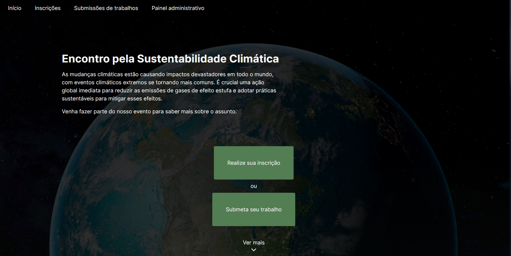

# Encontro pela Sustentabilidade Climática



Bem-vindo ao projeto do site para o nosso evento dedicado às mudanças climáticas! Este repositório contém o código-fonte e os recursos necessários para criar o website do evento, proporcionando informações essenciais, registro de participantes e acesso a recursos relacionados ao evento.

## Visão Geral

O evento sobre mudanças climáticas é uma iniciativa global destinada a reunir especialistas, líderes comunitários, ativistas e interessados de diversas áreas para discutir, colaborar e agir em relação ao desafio das mudanças climáticas. Nosso objetivo é fornecer uma plataforma para compartilhar conhecimentos, promover soluções sustentáveis e inspirar ações positivas para enfrentar esse desafio urgente.

## Funcionalidades do Site

O site do evento possui várias funcionalidades importantes, incluindo:

- **Informações do Evento:** Detalhes sobre o evento.
- **Inscrição no Evento:** Formulário de inscrição para participantes interessados em participar do evento.
- **Submissão de Trabalhos:** Plataforma para submissão de trabalhos relacionados ao tema do evento.
- **Visualização dos Trabalhos Submetidos:** Seção onde os participantes podem visualizar os trabalhos submetidos por outros participantes.

## Tecnologias Utilizadas

O site do evento é desenvolvido utilizando as seguintes tecnologias:

- React
- Next.js
- SASS
- HTML

## Estrutura do Projeto

O projeto foi organizado nas seguintes pastas:

- **src**: pasta principal do projeto, com pastas e rotas.
- **types**: Contém arquivos para definição de tipos e interfaces.
- **components**: Armazena componentes reutilizáveis do React.
- **context**: Contém os contextos do React utilizados na aplicação.
- **hooks**: Inclui os custom hooks utilizados no projeto.
- **assets**: Armazena imagens, animações e outros recursos visuais.
- **utils**: Contém utilitários e funções auxiliares utilizadas na aplicação.


# Tutorial de Instalação e Execução do Projeto

## Instalação das Dependências

Certifique-se de ter o Node.js e o npm (ou yarn) instalados em seu sistema. Em seguida, siga estas etapas:

1. **Clone o Repositório: https://github.com/caioRafael/evento-mudanca-climatica.git**

2. **Navegue até o Diretório do Projeto**

3. **Instale as Dependências:**

```bash
npm run install
# or
yarn install
# or
pnpm install
# or
bun install
```

4. **Inicie o Servidor de Desenvolvimento:**

```bash
npm run dev
# or
yarn dev
# or
pnpm dev
# or
bun dev
```

## Contato

[caiorafaelrg@gmail.com](mailto:caiorafaelrg@gmail.com).

